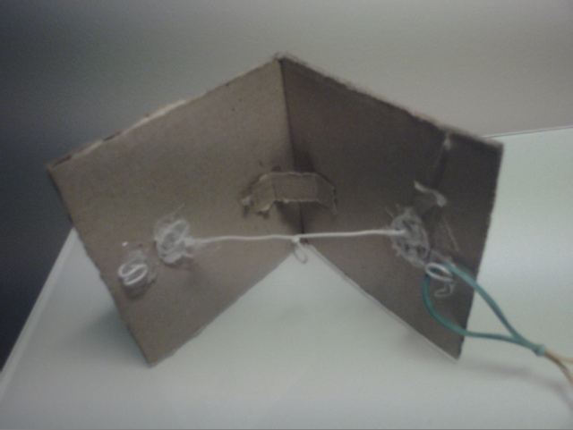
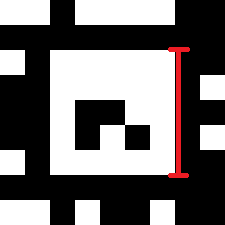

# April-Tag-VR-FullBody-Tracker
使用 AprilTag 标记在VR进行全身追踪。

这是我第二次尝试使用基准标记创建全身追踪系统。 这应该能够使人们获得免费的全身追踪，只使用手机和一些纸板。 使用尺寸小至 10 厘米的追踪器和 640x480 分辨率的PS3摄像头就可以获得不错的跟踪效果。 增加标记大小或使用更高的分辨率和更高帧率的摄像头可以进一步改善追踪效果。 

**注意：这是一个免费的开源项目。 您不需要为此使用 DRIVER4VR ！** 

要开始使用，您必须制作三个追踪器，每条腿一个，臀部一个。 仅使用腿部追踪器无法在 VRChat 中使用全身追踪！ 

此版本使用更准确的 AprilTag 系统，并包括许多改进以使系统更易于使用，例如优化后的 GUI 界面和更直接的校准。 

如果您遇到任何问题或 BUG，您可随时在 GitHub 提交 Issues 或在 Discord 上我留言。
https://discord.gg/g2ctkXB4bb

软件可以从 [发布](https://github.com/ju1ce/April-Tag-VR-FullBody-Tracker/releases) 页面下载.


节奏光剑效果演示: https://youtu.be/Akps-dH0EeA

### 简短的教程视频:
我不太擅长制作实际教程，但我录制了一段关于我如何配置这软件的短视频。 它不能替代下面的教程，但它可以帮助您更好地理解某些步骤。 

https://youtu.be/vhTF5ECTpKc

## 目录

- [Discord 服务器](https://github.com/ju1ce/April-Tag-VR-FullBody-Tracker/blob/master/简体中文教程（SimplifiedChineseTutorial）.md#我们现在有一个Discord服务器了！)
- [连接摄像头](https://github.com/ju1ce/April-Tag-VR-FullBody-Tracker/blob/master/简体中文教程（SimplifiedChineseTutorial）.md#连接摄像头)
- [制作追踪器](https://github.com/ju1ce/April-Tag-VR-FullBody-Tracker/blob/master/简体中文教程（SimplifiedChineseTutorial）.md#制作追踪器)
- [安装驱动](https://github.com/ju1ce/April-Tag-VR-FullBody-Tracker/blob/master/简体中文教程（SimplifiedChineseTutorial）.md#安装驱动)
- [运行AprilTagTrackers](https://github.com/ju1ce/April-Tag-VR-FullBody-Tracker/blob/master/简体中文教程（SimplifiedChineseTutorial）.md#运行AprilTagTrackers)
    - [摄像头](https://github.com/ju1ce/April-Tag-VR-FullBody-Tracker/blob/master/简体中文教程（SimplifiedChineseTutorial）.md#摄像头)
        - [启动或停止摄像头](https://github.com/ju1ce/April-Tag-VR-FullBody-Tracker/blob/master/简体中文教程（SimplifiedChineseTutorial）.md#启动或停止摄像头)
        - [校准摄像头](https://github.com/ju1ce/April-Tag-VR-FullBody-Tracker/blob/master/简体中文教程（SimplifiedChineseTutorial）.md#校准摄像头)
        - [校准追踪器](https://github.com/ju1ce/April-Tag-VR-FullBody-Tracker/blob/master/简体中文教程（SimplifiedChineseTutorial）.md#校准追踪器)
        - [连接SteamVR](https://github.com/ju1ce/April-Tag-VR-FullBody-Tracker/blob/master/简体中文教程（SimplifiedChineseTutorial）.md#连接SteamVR)
        - [启动追踪器](https://github.com/ju1ce/April-Tag-VR-FullBody-Tracker/blob/master/简体中文教程（SimplifiedChineseTutorial）.md#启动追踪器)
        - [校准至游玩空间](https://github.com/ju1ce/April-Tag-VR-FullBody-Tracker/blob/master/简体中文教程（SimplifiedChineseTutorial）.md#校准至游玩空间)
        - [多摄像头的校准](https://github.com/ju1ce/April-Tag-VR-FullBody-Tracker/blob/master/简体中文教程（SimplifiedChineseTutorial）.md#多摄像头的校准)
    - [更多参数](https://github.com/ju1ce/April-Tag-VR-FullBody-Tracker/blob/master/简体中文教程（SimplifiedChineseTutorial）.md#更多参数)
    - [已知问题](https://github.com/ju1ce/April-Tag-VR-FullBody-Tracker/blob/master/简体中文教程（SimplifiedChineseTutorial）.md#已知问题)
    - [待办事项](https://github.com/ju1ce/April-Tag-VR-FullBody-Tracker/blob/master/简体中文教程（SimplifiedChineseTutorial）.md#待办事项)
- [附言](https://github.com/ju1ce/April-Tag-VR-FullBody-Tracker/blob/master/简体中文教程（SimplifiedChineseTutorial）.md#附言)

## 我们现在有一个Discord服务器了！

https://discord.gg/g2ctkXB4bb

## 连接摄像头

第一步是将一个摄像头连接到您的计算机。 这一步可能有些复杂，因为您必须找出最适合您的方法。
每种方法都有其优点和缺点，因此您可以尝试一下哪种方法效果最好。 以下部分是我们推荐使用的方法，如果您有更好的方法，请随时使用。 

本教程仅概述连接摄像头的方法及其优缺点。 如果您有与这些摄像头相关的问题，您应该参考他们的官方教程。 在继续本教程之前，您应该让它工作。 

### 使用有线USB摄像头:

#### 优点:
* 大部分摄像头只需要插入 USB 接口即可使用
* 高质量的摄像头将提供良好的性能（例如 1080p 60fps）

#### 缺点:
* 要买到一个好的摄像头，很难。许多摄像头并不能适应快速运动，它们很容易在录像时产生运动模糊，又或者有一个很低的分辨率，或者有很多图像噪点，不了解摄像头的人很难买到一个好的摄像头。

如果您刚好有一个 USB 摄像头，您可以先尝试一下。 如果效果不好，您可以随时切换到手机。PS3摄像头可以使用，但几乎没人用，因为它分辨率低。 

为确保摄像头尽可能正常工作，请参考 [启动或停止摄像头](https://github.com/ju1ce/April-Tag-VR-FullBody-Tracker/blob/master/简体中文教程（SimplifiedChineseTutorial）.md#启动或停止摄像头) 部分.

#### 教程:

将摄像头连接到您的电脑就行了！ 如果您使用PS3摄像头，还要安装支持 jkevin 开发的 PS3EyeDirectShow 驱动，而不是 CLeye 驱动！ 

### 使用 IP-Webcam 无线串流手机:

#### 优点:
* 官方支持简体中文，支持通过网页后台远程管理
* 丰富的选项可供使用，自定义快门参数、串流质量等

#### 缺点:
* 需要高质量的 WIFI 连接
* 您的电脑和手机必须处于相同网络
* 仅限安卓手机使用

如果您的电脑和安卓手机连接到同一个路由器，并且手机上的 WIFI 信号也很好，那么您应该使用此选项。 

#### 教程:

从 GooglePlay 商店下载 "IP-Webcam" 应用，启动应用程序，在 视频设置 -> 视频分辨率 下，选择您要使用的分辨率。 您应该尝试使用分辨率为 800x600 左右的 4:3 纵横比。 然后返回主界面，将页面下滑到至页面底部并点击开启服务器。 如果您想打开网页后台：点击 如何连接？-> 直接连接 -> 我在使用 WIFI 路由器
如果您不知道怎么做

为确保摄像头尽可能正常工作，请参考 [启动或停止摄像头](https://github.com/ju1ce/April-Tag-VR-FullBody-Tracker/blob/master/简体中文教程（SimplifiedChineseTutorial）.md#启动或停止摄像头) 部分.

### 使用 IP-Webcam 有线串流手机:

#### 优点:
* 官方支持简体中文，支持通过网页后台远程管理
* 丰富的选项可供使用，自定义快门参数、串流质量等


#### 缺点:
* 配置起来稍微有些难，部分手机和电脑存在不兼容的情况
* 很多手机还在使用 USB2.0 协议，这种手机可能出现有线速率比无线速率还要慢的情况

如果您没有良好的 WIFI 连接，或者有一些比较新款的安卓手机，您应该尝试此选项。 

#### 教程:

为此，我们将通过 "USB 网络共享" 功能使用我们的手机网络。 这通常用于与计算机共享手机网络或 WIFI，但如果我们在手机上禁用 "WLAN" 和 "数据网络"，我们也可以将其用作手机和电脑之间的直接连接。 首先禁用 "WLAN" 和 "数据网络"。 然后使用 USB2.0 或更高规格的数据线将手机连接到电脑。 然后在您的手机上启用 "USB 网络共享"，这选项通常在 "个人热点" 的附近 。 现在，您可以按照与上面无线串流方案相同的教程进行操作！ 

注意：确保您的 "数据网络" 已禁用，否则将会消耗大量流量！

### 使用 DroidCam OBS:

#### 优点:
* 大部分手机都能用，包括苹果手机
* 有线串流或无线串流

#### 缺点:
* 可配置的选项比 IP-Webcam 更少
* 更高的传输延迟

如果之前的选项不适合您或者您有一部苹果手机，那么您应该选择这个选项。 此选项的兼容性应该会好一些，无论是无线还是有线。 

#### 教程:

首先按照 DroidCam OBS 官方教程获取手机-OBS连接。 使用 720p 视频分辨率以确保没有水印。
然后，按照 OBS VirtualCam 插件教程流式传输到虚拟摄像机。
手机现在将充当普通网络摄像头。 

## 制作追踪器

### 追踪器的工作原理


这是单个 Apriltag 标记。 每个标记的中间都有一个白色方块用于检测，还有一个独特的黑白图案用于识别。 这意味着单个标记必须始终完全可见且完全平坦才能被检测到。 

一个追踪器由多个面向不同方向的 AprilTag 组成，确保在旋转时至少可以看到一个 AprilTag。
当 AprilTagTrackers 在追踪每个追踪器时，在这个追踪器上找到一个 AprilTag，它启动的是最基本的跟踪，两面 AprilTag 才能得到准确跟踪，三面 AprilTag 将得到非常平稳的追踪。如果在旋转时只能找到一面 AprilTag，那可能会导致反向旋转 
每个追踪器必须全部固定在一起，并且追踪器中包含的任何标记都不应单独移动或弯曲。
也就是说，它们必须保持刚性结构，不仅追踪器本身要保持结构稳定，而且每个粘贴 AprilTag 的地方必须平整，不得弯折。
第一个追踪器由标记由 id 为 0 的 AprilTag 和任意数量的 id 范围 1-44 的额外标记组成，第二个追踪器由 id 为 45 的 AprilTag 和任意数量的 id 范围 46-89 的额外标记组成，以此类推。 
不修改配置文件的情况下，当前版本共有 2115 个 AprilTag 可用，每 45 个划分为一组。

三个追踪器的最简单版本如下：第一个追踪器由 id 为 0 的 AprilTag 和 id 为 1 的 AprilTag 组成，第二个是 45 和 46，第三个是 90 和 91 ，这些 id 分别对应 front 文件的第一、第二、第三行。为了防止弯曲，它们被粘在纸板上。 它们中的每一个都以 90° 角粘合在一起。 要自己制作，请打印 Apriltag.pdf 文件。 请参考下面的照片将它们剪下来并正确粘合。 
很多打印机使用的是A4纸，这种情况下需要打印的文件是 charuco_board.pdf 和 apriltags_front_475.pdf 和 apriltag_back_475.pdf


沿红线切割，沿蓝线弯曲。 您要打印的是 pdf 文件而不是这张图片。 


追踪器从正面看起来是这样的


追踪器从上面看起来是这样的


腿部追踪器后面的特写。 请注意用于支撑弯曲的小纸板和用于橡皮筋的挂钩。 



第一个追踪器将在臀部使用，并且由于橡皮筋会使它拉伸得更多，因此应该使用一些额外的支撑。 我用了一些金属丝，但您可以使用更多的纸板。 

添加一些将追踪器固定到您身体上的方法。 我使用了一些挂钩，然后我可以通过这些挂钩使用橡皮筋固定追踪器。 

注意：确保纸板上的AprilTag清晰可见且未被遮挡！ 确保粘贴AprilTag的地方不要弯曲！ 

## 安装驱动

**从 0.4 版开始，我们有一个安装程序！ 只需从 driver_files 运行 install_driver.exe，它就会为您完成这些步骤！** 

以下是手动安装驱动的步骤：
在 driver_files 文件夹中，有一个 apriltagtrackers 文件夹。 将此文件夹复制到 "Steam/steamapps/common/SteamVR/drivers". 现在，打开 "Steam/config/steamvr.vrsettings" 并在 "steamvr" 下添加这些字段 ```"activateMultipleDrivers" : true,``` . 就像是这样:
```
"steamvr" : {
      "activateMultipleDrivers" : true,
      "installID" : "17046041383408253036",
      "lastVersionNotice" : "1.15.10",
      "lastVersionNoticeDate" : "1605567489",
      "showAdvancedSettings" : true
   },
```

这将确保每次我们启动 SteamVR 时，它都会尝试通过我们的驱动程序连接到 ApriltagTrackers 程序。

## 运行AprilTagTrackers

您现在可以运行 Start_ApriltagTrackers.bat！ 如果找不到，请确保从发布选项卡下载了正确的文件。 第一次启动它时，您可能会看到一个黑色的控制台窗口几秒钟。 以下是有关按钮和参数功能的快速指南。 

### 摄像头

"Camera" 是主要的选项卡，在使用 AprilTagTrackers 时，它将和您度过大部分时间。 

#### 启动或停止摄像头

启动摄像头或在摄像头运行时停止它。 此按钮将根据您在参数选项卡中填写的摄像头ID来打开摄像头。 为了确保您的摄像头处于打开状态，您可以勾选 “Preview camera” 复选框。

如果摄像头无法启动，请确保您的摄像头已连接并正常工作，您已写入正确的摄像头 id ，并且您在更改参数后已保存参数。 如果您使用的是 USB 摄像头或 OBS 虚拟摄像头，请尝试使用不同的 ID，它应该是为 0 到 10 之间的数字。 您可能还需要在参数中设置正确的摄像头宽度/高度。 

##### 针对于 USB 摄像头的参数配置

我们必须确保摄像头正确打开，预览窗口未缩放。如果您使用 1080p 摄像头并且您的显示器也是 1080p，则该窗口将覆盖整个屏幕。如果它太小或周围有黑条，我们必须修理它。首先，输入正确的宽度和高度参数。

如果没有打开或者窗口虽然更大但仍然有黑条，我们必须查看摄像头 api 并将其更改为 DirectShow，也就是在 "Params" 选项卡中将 "Camera API preference" 的值设为 "700"，并点击 "Save" 按钮，应该可以解决分辨率问题。但是摄像头现在可能具有较低的 fps，在这种情况下，请将分辨率降低到 720p。

如果您已经试过各种参数但摄像头依然无法工作，您可以为 OBS 安装 virtualcam 插件，之后启动 OBS 并添加一个 "视频采集设备"。当您看到摄像头的画面显示在 OBS 内显示时，打开工具栏中点击"虚拟摄像头"，然后在弹出的窗口点击"启动"。
使用这种方式进行画面格式的转换会导致性能损耗并增加延迟，除非万不得己，否则不要使用。

除此之外，为了得到更好的追踪性能，我们仍然需要尽可能多地从摄像头中消除运动模糊，否则在我们快速移动时会丢失跟踪。为此，我们必须减少摄像头的曝光时间。第一步，如果摄像头支持 60fps，在 "Params" 选项卡中，在 "Camera FPS" 处填写 "60" 。PS3摄像头支持 70。

然后，有几种方式可以给您的摄像头设置曝光。首先是您的摄像头软件，一些摄像头比如罗技他们会提供自己的软件，您可以在其中设置曝光和增益。其次，如果您使用 DirectShow API，您可以在 "Params" 选项卡中勾选 "Open camera settings"，然后点击 "Save" 按钮，再打开您的摄像头，这应该会弹出摄像头的设置窗口。第三，您可以在 "Params" 选项卡中勾选 "Enable 3 options below"，然后点击 "Save" 按钮，并在 "Camera autoexposure" 和 "Camera exposure" 和 "Camera gain" 填写您想要的值。

在实际配置过程中，我们首先必须禁用自动曝光。如果成功地弹出了摄像头的设置窗口，它将会提供一个关于此功能的复选框。若不能弹出设置窗口在"Params"选项卡中将 "Camera autoexposure" 的值配置为0。对于"Camera exposure"，此值通常为2的指数。我们需要至少8ms，即-7，但理想情况下为 4ms 或 -8。对于 "Camera gain"，根据实际需要设定，只要让图像看起来具有一个正常的亮度即可。

您还可以勾选 "Rotate camera clockwise " 以横向旋转摄像头视图。这将为您提供更多的垂直空间，这意味着您可以更靠近摄像头。 完成所有关于摄像头的设置后，您需要在 "Camera" 选项卡点击 "Start/Stop camera" 重新启动您的摄像头以应用这些设置。

##### 针对于 "IP-Webcam" 的参数配置

对于 IP 网络摄像头，您可以在应用中设置分辨率，尝试使用 4:3 的纵横比，大约 800x600 效果最佳。 如果您使用所有三个追踪器，请使用纵向模式。如果您的手机支持，您也可以在配置"场景模式"为"快速运动物体"。

在下载的文件夹中，/utilities 中有一个 set_exposure.bat 脚本。 编辑它，写入您的摄像头 IP 地址和所需的曝光度 - 测试一些以找到亮度最佳的那个，但它应该低于 10 ms 或 10000 ns。

如果您的手机支持，运行此脚本现在将设置您手机摄像头的曝光。

这些配置，通常也可以用网页后台来进行操作。

#### 校准摄像头

您需要打印 "images to print" 文件夹中的 "charuco_board.pdf“ 并将其放在平坦的表面上，取消勾选 "Preview camera"，检查您的摄像头设置确保在您的摄像头上禁用自动对焦，然后点击 "Calibrate camera" 按钮就会启动摄像头校准序列。需要注意的是除非您在这一步做错了，否则校准摄像头这种事只应该在您第一次使用该程序以及更换正在使用的摄像头时进行。

一个窗口将会出现并显示摄像头所看到的画面，拿起您的摄像头并使其和 "charuco_board" 图案保持水平，然后向不同方向缓慢地移动您的摄像头。每隔几秒钟，摄像头就会拍一张照片，然后将在这窗口中描绘出一些线条和彩色点，笔直的线条和均匀分布的紫色点意味着良好的校准。从尽可能多的不同角度拍摄 "charuco_board" 图案，您可以在一开始将摄像头靠近 ”charuco_board“ 图案并保持，直到在前10个图案完成拍摄，然后您可以尝试抬高摄像头，但不要太高。

关于校准质量好坏的判断，当您运行校准过程时，拍摄到的边角将作为点留在图像上，颜色代表它们的重投影误差：黄色是校准错误，紫色是优秀的校准，绿色是一般的校准。在继续下一步之前，请确保大多数点都是紫色的！
还有那些网格，它必须很好地分布在整个图像上，尽可能少地晃动。大约拍摄30张图片后，点击"确定"按钮保存校准。

有时，如果图片太模糊或照明太差，则无法检测到图案。确保您有均匀的照明，不要使用白炽灯。

或者，您可以在屏幕上显示图像并使用它进行校准，但校准可能会更糟或根本不起作用。您还可以使用参数中的棋盘切换到旧校准，以防您无法打印新棋盘但周围有棋盘。


使用木制棋盘进行校准。虽然该板与您将使用的 charuco 板不同，但过程是相同的。 

#### 校准追踪器

点击 "Calibrate trackers" 按钮将开始追踪器校准，但首先，摄像头应处于运行状态和并完成了摄像头校准。如果您正在尝试结构可能在佩戴时发生改变的追踪器，在开始追踪器校准前就要完成佩戴，而完全保持刚性结构的追踪器可以放心地拿在手上校准。您需要在在首次启动时和更改追踪器时执行此追踪器校准步骤。

通过将追踪器移动到距摄像头30厘米以内的位置，让摄像头看清您的追踪器。要将为您的追踪器添加 AprilTag 的面数，摄像头需要在这个追踪器上看到一个已添加的 AprilTag。绿色标记表示已添加，在每 45 个为一组那些 AprilTag 中，第一个 AprilTag 将作为基准并总是处于此状态。黄色表示正在添加，您只要拿稳您的追踪器并保持一会即可。红色表示无法添加，因为没有看到已添加的标记。紫色表示追踪器离摄像头太远。重复此过程，直到所有追踪器上的所有标记均为绿色，然后单击 "OK" 按钮以保存校准。

如果某些 AprilTag 显示出一个蓝色轮廓，则表示这些 AprilTag 被检测到，但不属于任何追踪器。您应该检查 "Params" 选项卡中 "Number of trackers" 的值，它通常应设置为为 3，若您更改了此值您应该点击 "Save" 按钮以保存。

如果根本没有检测到标记，请确保您的摄像头没有镜像。


追踪器校准示例。稍微旋转一下追踪器。无论为追踪器检测到的标记数量如何，轴都应该很好地跟随。 

#### 连接SteamVR

确保SteamVR已启动。 当您按下 "Connect to SteamVR" 按钮时，程序将连接到 SteamVR。 如果连接成功，在SteamVR窗口中您将在头显和手柄旁边看到追踪器和基站。
* 注意！若您以管理员模式启动Steam，您也必须以管理员模式启动AprilTagTrackers，否则会因为权限不足而导致连接失败。

如果您退出了SteamVR，您必须在再次启动后再次点击 "Connect to SteamVR" 按钮。 当它要求重新启动连接时按是。


将您的摄像头放在臀部高度附近的某个地方。 从 v0.3 开始，摄像头的方向无关紧要。

如果追踪器没有显示在 SteamVR 窗口中，但点击 "Connect to SteamVR" 不会引发错误，则说明您尚未将 activateMultipleDrivers 选项添加到配置中 - 再次尝试执行此操作，但要小心放置它的位置，并且逗号在 正确的地方。 

#### 启动追踪器

开始之前戴好您的追踪器，并禁用 SteamVR Home，否则白色摄像头的模型将不会显示。 从 SteamVR 仪表板打开虚拟桌面，然后用手柄控制鼠标指针并点击 "Start/Stop" 按钮。 它将启动程序并打开检测窗口。

在窗口中，您可以看到以下内容： 检测到的 AprilTag 将具有绿色轮廓，其 id 以蓝色书写。 在标记周围，会有蓝色圆圈：它们代表在检测过程中搜索的区域。 如果未找到所有追踪器，则每秒搜索整个垂直区域。 发生这种情况时，您会看到蓝色方块而不是圆圈。

请注意，追踪器是置顶显示的，因此它们始终可以被看到，但那个白色摄像头并不是置顶显示，这意味着它有可能被您的 SteamVR 仪表盘或是虚拟桌面或是其它东西挡住。 

#### 校准至游玩空间

起初，追踪器可能远离您并处于某个角落，如果您已经关闭 SteamVR Home，原地旋转一圈应该能看到他们 您需要校准游玩空间才能在游戏中使用它们。通过勾选 "Calibration mode" 复选框来执行此操作。

现在 SteamVR 的虚拟世界中应出现一个白色摄像头，程序中应出现六个字段。 使用前三个字段将虚拟世界中的 摄像头与现实生活中的的摄像头对齐。为了准确获取位置，最好将您的一个控制器放在摄像头旁边并将其用作参考。
对齐位置后，使用接下来的三个值来对齐旋转。

也许对于有些人来说，运行上面这种校准方式是十分困难的，所以从 0.5.4 开始您可以使用左手柄进行快速校准，该功能仅在 "Calibration mode" 复选框处于勾选状态时启用。
将左手柄的扳机按到底进入移动模式，此时移动您的左手柄，虚拟世界中的摄像头也会开始移动，当您再次将扳机按到底时就会退出移动模式，反复使用移动模式使虚拟世界的摄像头与现实世界的摄像头处于相同位置。
然后按下左手柄的抓握键进入旋转模式，此时旋转您的左手柄，虚拟世界中的摄像头也会开始旋转，当您再次按下抓握键时就会退出旋转模式，反复使用旋转模式使虚拟世界的摄像头与现实世界的摄像头面朝向同一方向，并保持相同的旋转与倾斜角度。 

当摄像头粗略对齐时，请走到摄像头前面，以便可以摄像头看到追踪器。您现在可以对摄像头的位置进行一些更精细的调整，当虚拟世界的摄像头与现实世界的摄像头的位置完全吻合，此时虚拟世界中的追踪器应当与现实生活中的 AprilTag 处于相同位置，您可以将一个手柄放在 AprilTag 上以检查它们的位置是否真的吻合。

完成后，取消勾选 "Calibration mode" 以保存这些校准数据！ 

#### 多摄像头的校准

使用上面的方法通常可以将一个摄像头好好儿地校准，但对于多个摄像头来说，它们可能报告不同的追踪器位置，当这种情况出现时将导致虚拟世界中的追踪器产生剧烈抖动。只靠手动校准几乎不可能让多个摄像头保持一致的定位结果，除非头显支持混合现实功能，不过考虑到大多数人都没有那样的头显，所以我们开发了自动化的精炼校准。

首先您可以将 AprilTagTrackers 程序复制多份并存放在不同的文件夹，每份对应一个摄像头，每当启动一个 AprilTagTrackers 时，为了避免混淆，我们叫它启动了一个实例。
在开始之前，您需要为所有实例逐一进行手动校准，然后以其中的一个实例作为基准A，保持这个实例和另一个想要校准的实例B都已进入工作状态，并按 "Start/Stop" 按钮让其它实例停止工作。
然后在B实例上勾选 "Calibration mode"，再勾选 "Refine calibration using second camera"，这会使B实例与其它实例进行数据交换，大约2秒后取消B实例的 "Refine calibration using second camera" 和 "Calibration mode"，这样就完成了B实例的校准。

当您想校准C实例，建议保持A基准实例处于工作状态，并让B实例处于停止工作状态。如果A基准实例和B实例都处于工作状态，那么C实例就会同时和A基准实例和B实例一起交换数据，当B实例的定位质量太差时，这样会导致更多不好的结果。


### 更多参数

以下是您可以设置的参数的简短说明，它们可以在 "Params" 选项卡中找到。
有的参数并不是在所有版本都出现。

更改参数时，一定要按保存，否则不会生效！ 虽然有些更改会在保存后立即生效，但您可能需要为其它更改重新开始跟踪（点击 "Camera" 选项卡上的开始按钮停止，然后再次按开始开始。执行此操作后您无需重新校准至游玩空间）。 

#### Ip or ID of camera:

如果您使用 USB 摄像头或 OBS，此值应一个数字，如果您连接了更多摄像头，通常为 0、1 或更多。 要找出摄像头的 ID，您可以逐一尝试：输入 0，点击" Save" 按钮，返回 "Camera" 选项卡，勾选 "Preview Camera" 并点击 "Start/Stop camera"。 如果出现正确的摄像头，您可以进行下一步。如果没有，请尝试输入 1 并再试一次 重复该过程，直到找到您的摄像头。如果您的电脑刚好安装了 OBS，您可以在 OBS 中尝试添加视频采集设备，您能在这个页面查看您的电脑当前连接了哪些摄像头，第一个摄像头的 ID 为 0，之后的每个摄像头在此基础上上 +1.

如果您使用IP-Webcam，您应该输入您手机的IP地址，与您在浏览器中使用的相同，但以 /video 结尾。 该字段如下所示：```http://192.168.1.100:8080/video``` 实际使用替换为自己的ip。

#### Number of trackers:

您希望使用的跟踪器数量。 对于全身追踪，您需要填写 3。您不能在 VRchat 中仅使用 2 个追踪器！ 

#### Size of markers in cm:

测量AprilTag边界区的边长并填写至此，边界区在白色方框和黑色方框的交界处，如下所示：




实际上，通常应以毫米为单位测量，1 毫米以上的误差将伴随肉眼可见的异常位姿，例如 Avatar 腰间盘突出。
* AprilTag的大小可以自行改变，但不要太小，这会在低分辨率产生更多抖动。
* 所有追踪器的 AprilTag 必须保持相同大小
* 混用不同的打印机可能会打印出不同大小的 AprilTag

#### Rotate camera clockwise/counterclockwise:

如果您将现实生活中的相机竖着摆放，这也许能使您站得离摄像头更近，并勾选 "Rotate camera clockwise" 这会将摄像头采集到的画面旋转 90°，用这种方式可以牺牲水平视角换垂直视角，这对于没有太多空间或使用低分辨率摄像头 (640x480) 的人们是有帮助的。 您还可以选中两者以将摄像头旋转 180°。 

#### Number of values for smoothing:

该参数的值配置用于滑动窗口均值平滑算法的样本数量。 它会将这些样本进行排序，并选用靠近中间位置的样本，这样就能够删除一些离群值，但会增加延迟。5 似乎是延迟和性能之间的最佳平衡，但有些人可以降低到3来减少延迟。
* 仅 0.4 版本。

#### Smoothing time window:

此参数用于控制线性插值要使用时间窗口，最佳范围 0.2-0.5，增加此值将减少抖动，但会增加延迟和惯性。

#### Depth smoothing:

由于普通的摄像头难以获得准确的深度数据，使用此功能可以使深度数据的抖动更加平缓。严格地说，这并不是消除抖动，而是将不规则抖动稀释，使其保持较为均匀的晃动速度。
您可以填写像是 0.0 0.2 0.5 这样的值，若您不理解这些知识，请保持该选项为0.0
* 仅 0.5.4 版本。

#### Additional smoothing:

虽然上面的方法做了一些平滑处理，但可能并不足以消除抖动。 使用泄漏积分器进行额外平滑，公式为：current_position = previous_position * value + tracked_position * (1-value)。 

该参数的值只能使用0到1之间的值，0.5 意味着参考 50% 先前的位置，0.7意味着参考 70% 先前的位置，0 意味着使用即时位置。减小值会增加速度，但也会增加抖动，尝试不同的值以找到最佳点。 
* 驱动层参数，该选项对所有实例有效，以最后保存的结果为准。

#### Quad decimate:

该算法轻微地降低 AprilTag 被检测到的概率并大幅提升检测速度，原理是以低分辨率在图像中查找 AprilTag，再以全分辨率计算其位姿。该值可以是 1、1.5、2、3 或 4。该值越高，每张图像所需的检测时间就越短，但会降低从这张图像上检测到 AprilTag 的概率。 这具体取决于您使用的摄像头。 低分辨率的摄像头只能使用 1，否则将显著地降低检测率，高分辨率的摄像头可以使用更高的值。（当您的检测时间很短，您可以减少它以换取跟踪质量。当您的检测时间很长，您可以增加它以换取检测速度） 

#### Search window:

为了提高性能，该算法仅在追踪器历史位置的附近寻找追踪器。此参数设置搜索范围的大小。降低这个值会使搜索范围变小，但会让程序运行得更快，不过也有可能会因此丢掉追踪，尤其是曝光时间长的摄像头。

根据值的大小，搜索范围将以圆圈或是方框绘制在 "out" 窗口中。 追踪器必须至少在其中的一个圆圈内，否则将不会被追踪。 

#### Marker library:

切换 AprilTagTrackers 运行时所使用的二维码编码，除非您十分了解 AprilTagTrackers 和它的工作原理，否则将保持此处为 "ApriltagStandard"。
* 仅 0.5.4 版本。

#### Ignore tracker 0:

这将在软件内屏蔽第一个追踪器。如果您想用 vive 追踪器或 owotracker 替换掉臀部追踪器，请勾选此选项。 但您仍需设置追踪器的数量为 3。

#### Use previous position as guess:

此参数设置在估计检测到的追踪器的 3d 位置时，算法是否应使用先前的位置作为猜测来帮助它。 除非您知道自己在做什么，否则应该保持勾选。 
* 已弃用。

#### Use circular search window:

在先前已知位置周围的圆形窗口中搜索追踪器或使用垂直框。 由于使用圆形窗口要快得多，因此通常没有理由不使用它们。
* 已弃用。 

#### Camera FPS:

摄像头的FPS。 如果要使用60fps摄像头，请将其设置为 60。 

#### Camera width/height:

您通常可以将其保留为 0，程序将自动确定正确的宽度和高度。

在某些摄像头上，通是 OBS，摄像头会以错误的分辨率和纵横比打开。 在这种情况下，用正确的值替换这些值。 

#### Camera latency:

一个实验功能。 理论上，这应该告诉 SteamVR 我们发送的位置有多旧。 然而，它似乎并没有完全做到这一点，但仍然改善了延迟。

该参数默认值为0，您通常可以将其设置为1，这似乎可以改善延迟并减少延迟，如果遇到任何异常请保持为 0.
* 在 0.5.4 版本可以设置精确到小数点后的值

#### Open camera settings:

勾选此项并启动摄像头，将弹出摄像头的设置窗口，但只在少数摄像头生效。 您可以试试，它可能对您有用。 

#### Use chessboard calibration:

使用旧的棋盘校准。 强烈建议切换到新校准，但如果您已经有棋盘并且还不能打印新图案，则可以选中此选项以使用旧系统。 
* 已弃用。

### 已知问题：

如果摄像头只在追踪器上看到一个 AprilTag，追踪器可能会朝向错误的方向。 注意观察腰部，在这视频第 4 秒的时候，腰部有一个不自然的旋转： 


https://user-images.githubusercontent.com/91396010/134815082-f61b674a-8aad-4b91-8032-b860a1ec93c7.mp4


增加 AprilTag 的面数并修改彼此的链接角度可有效解决该问题，关于这点，45° 比 90° 更安全，
在我们制作更多 pdf 之前，您可以用 Google 搜索 "tagStandard41h12" ，并自行制作制作一些 AprilTag 打印件。


### 待办事项：

* 在 IP-Webcam 上减少曝光的教程（已完成）
* 虚拟臀部，只需使用腿部追踪器 （已完成）

## Sources
Olson, Edwin. "AprilTag: A robust and flexible visual fiducial system." 2011 IEEE International Conference on Robotics and Automation. IEEE, 2011.

https://github.com/AprilRobotics/apriltag

WxWidgets: A Cross-Platform GUI Library

https://github.com/wxWidgets/wxWidgets

### 附言
AprilTagTrackers 的官方网址为：https://github.com/ju1ce/April-Tag-VR-FullBody-Tracker
，您需要在转载此文档时保留这句话。
若您对简体中文的汉化结果有异议，您可以发送邮件到 chiliplanet@foxmail.com 与我取得联系。
